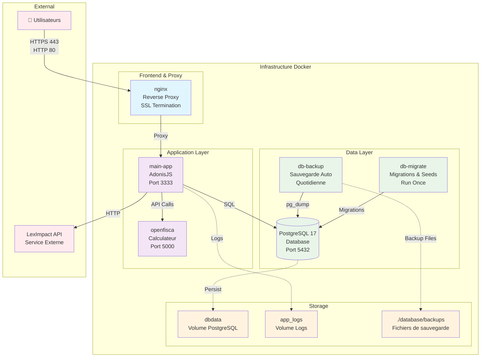
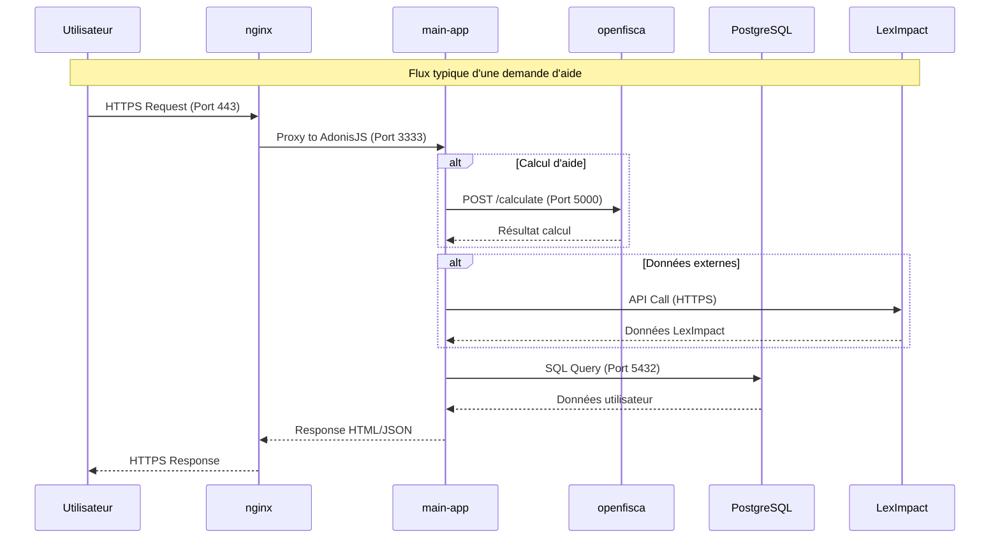

# Architecture Overview - Aides Simplifiées Infrastructure

## 1. Architecture générale du système

```mermaid
graph TB
    subgraph "Infrastructure Docker"
        subgraph "Frontend & Proxy"
            nginx[nginx<br/>Reverse Proxy<br/>SSL Termination]
        end
        
        subgraph "Application Layer"
            main[main-app<br/>AdonisJS<br/>Port 3333]
            openfisca[openfisca<br/>Calculateur<br/>Port 5000]
        end
        
        subgraph "Data Layer"
            db[(PostgreSQL 17<br/>Database<br/>Port 5432)]
            migrate[db-migrate<br/>Migrations & Seeds<br/>Run Once]
            backup[db-backup<br/>Sauvegarde Auto<br/>Quotidienne]
        end
        
        subgraph "Storage"
            dbdata[dbdata<br/>Volume PostgreSQL]
            logs[app_logs<br/>Volume Logs]
            backups[./database/backups<br/>Fichiers de sauvegarde]
        end
    end
    
    subgraph "External"
        users[👥 Utilisateurs]
        leximpact[LexImpact API<br/>Service Externe]
    end
    
    users -->|HTTPS 443<br/>HTTP 80| nginx
    nginx -->|Proxy| main
    main -->|API Calls| openfisca
    main -->|SQL| db
    main -->|HTTP| leximpact
    migrate -->|Migrations| db
    backup -->|pg_dump| db
    
    db -.->|Persist| dbdata
    main -.->|Logs| logs
    backup -.->|Backup Files| backups
    
    classDef frontend fill:#e1f5fe
    classDef app fill:#f3e5f5
    classDef data fill:#e8f5e8
    classDef storage fill:#fff3e0
    classDef external fill:#ffebee
    
    class nginx frontend
    class main,openfisca app
    class db,migrate,backup data
    class dbdata,logs,backups storage
    class users,leximpact external
```

## 2. Flux de données et communication

```mermaid
sequenceDiagram
    participant U as Utilisateur
    participant N as nginx
    participant M as main-app
    participant O as openfisca
    participant D as PostgreSQL
    participant L as LexImpact
    
    Note over U,L: Flux typique d'une demande d'aide
    
    U->>N: HTTPS Request (Port 443)
    N->>M: Proxy to AdonisJS (Port 3333)
    
    alt Calcul d'aide
        M->>O: POST /calculate (Port 5000)
        O-->>M: Résultat calcul
    end
    
    alt Données externes
        M->>L: API Call (HTTPS)
        L-->>M: Données LexImpact
    end
    
    M->>D: SQL Query (Port 5432)
    D-->>M: Données utilisateur
    
    M-->>N: Response HTML/JSON
    N-->>U: HTTPS Response
```