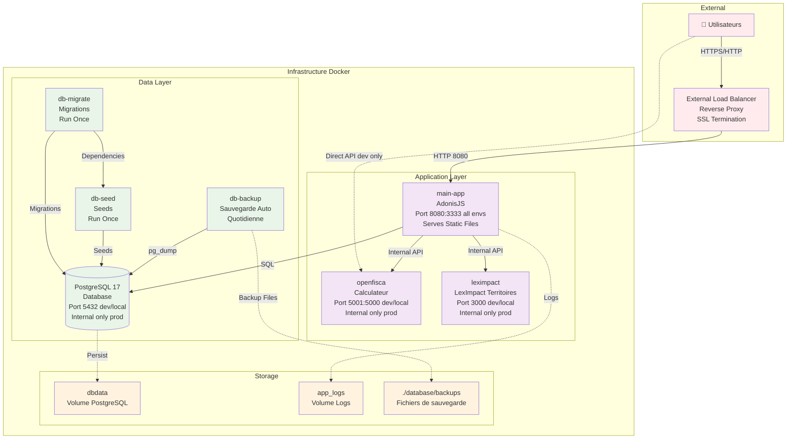
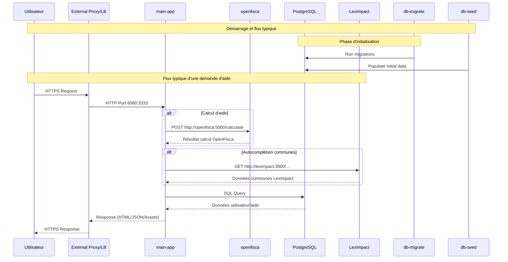

# Architecture Overview - Aides Simplifiées Infrastructure

## 1. Architecture générale du système

### Environnements et ports

| Service | Développement (dev) | Local (local) | Production (prod) |
|---------|---------------------|---------------|-------------------|
| main-app | 8080:3333, 9229:9229 | 8080:3333, 9229:9229 | 8080:3333 |
| openfisca | 5001:5000, 5678:5678 | 5001:5000, 5678:5678 | Interne seulement |
| leximpact | 3000:3000 | 3000:3000 | Interne seulement |
| database | 5432:5432 | 5432:5432 | Interne seulement |

**Différences clés:**
- **dev**: NODE_ENV=development, build target=development, commandes ace directes
- **local**: NODE_ENV=production, build target=production, volumes montés, debug ports
- **prod**: Images pré-construites, pas de ports debug, sécurité renforcée

### Diagramme d'architecture

## 2. Flux de données et communication

